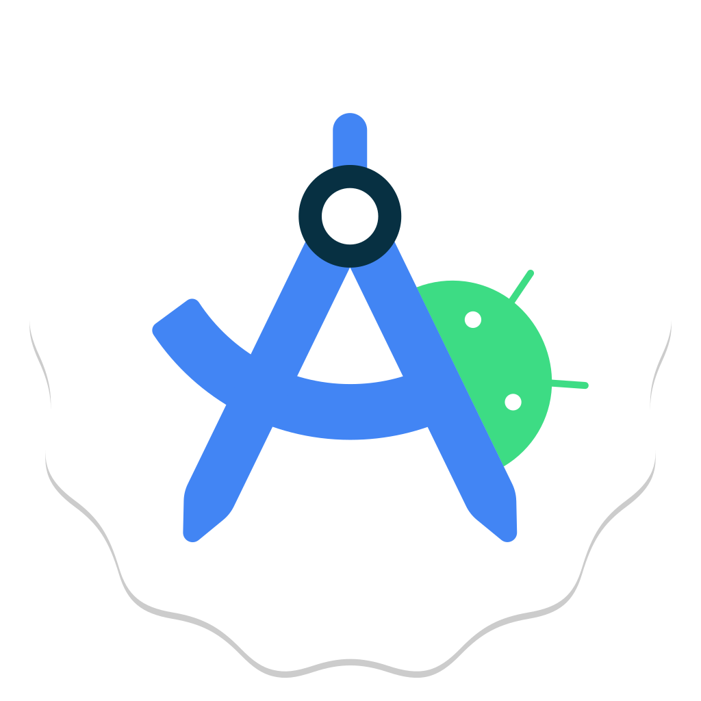

<h1 align="center"> Hello There! I'm Darrel👋 </h1>

IT student in Yogyakarta State University  
Get in touch with me, 
<a href="mailto:ashilpa.darrel@gmail.com"> ashilpa.darrel@gmail.com </a>

 

  
  
  
  
  
  
  

<!--
## Education
#### [Yogyakarta State University](https://www.uny.ac.id/) | Bachelor of Information Technology | Yogyakarta, 2022 - now
- Infinite IT Organization as Member
#### [Kalasan High School](https://www.sman1kalasan.sch.id/) | MIPA | Sleman, 2019 - 2022
- MPK Organization as IT Division Staff

## Work Experience:
- Design Graphic freelancer at [Fiverr.com](https://fiverr.com/ashilpadarrel)

## Project Experience:
- [ContributeIn](https://github.com/DarrelBumika/contributein) | Web Platform | Study Project
- [Student Data Management](https://github.com/DarrelBumika/Pemrograman-Web) | Web | Study Project
- [Match Your Vacation](https://github.com/DarrelBumika/SPK-SAW) | Web | Study Project
- [Rock Paper Scissors Image Clasification](https://github.com/DarrelBumika/Machine-Learning) | Machine Learning | Study Project

## Competitions
- OSK Kabupaten & Provinsi 2019 - 2020 | Competitive Programming
- Gemastik 2023 | Competitive Programming
- Unity 2024 | Competitive Programming

---

## Languages and Tools

  
  
  
  
  
  
  

